# QuickBooks Ledger MCP 0.6.0 release boundary

## PM conclusion

This version is suitable for a controlled Sandbox demo and developer handoff. It demonstrates per-user OAuth, exact Company binding, accountant reads, typed document intake, governed Case preparation, standing-delegation execution, provider receipt, and exact read-back.

It is not a production accounting close/tax engine and does not release all 71 official Intuit write operations to an Agent. The catalog and the released workflow are deliberately separate.

## Architecture

```mermaid
flowchart LR
  C["Client / document source"] --> S["Drive, DB, or WorkStore MCP"]
  S --> A["Internal accountant Agent"]
  A --> Q["QuickBooks Ledger MCP"]
  Q --> O["Per-installation OAuth binding"]
  O --> T["Exact Company target session"]
  T --> K["Accounting Case compiler + control kernel"]
  K --> P["QuickBooks Online"]
  P --> R["Provider receipt + exact read-back"]
```

Xero is a separate MCP and deployment. It may be configured on the same Agent, but it shares no OAuth token, write policy, Company/Organisation binding, mutation table, or repository with this service.

## Released journey

1. Agent2 starts OAuth; the user consents on Intuit.
2. The connector creates one installation identity and stores one active QBO Company connection.
3. The Agent resolves a short-lived target session, reads Company/history/reference data, and prepares an Accounting Case.
4. The compiler verifies supplied-source coverage, fact revision lineage, document totals, tax inputs, currency rules, exact references, and released actions.
5. Execution requires the matching transport scope, exact standing delegation, write kill switch, static capability policy, unchanged OAuth binding, and target session.
6. Every provider mutation is idempotent and must end with receipt plus read-back or a recovery state.

## Capability layers

| Layer | Meaning | 0.6.0 status |
|---|---|---|
| Official Intuit catalog | Operations Intuit's official MCP/API can expose | Catalogued for product planning |
| Deployment policy | Operations enabled for this environment and Company | Default-safe, explicit allowlist supported |
| Accounting Case release | Operations an Agent can compile from typed business facts | Six create capabilities |
| Standing delegation | Exact actions this Agent installation may execute autonomously | Explicit list; empty/unknown list fails startup |

## Intentionally not released

- cash receipt/payment, refund, deposit, transfer;
- JournalEntry;
- delete/void and CompanyInfo changes;
- general updates and arbitrary provider-shaped payloads;
- automatic cross-ledger copying between Xero and QuickBooks;
- external/public Client Intake access to ledger credentials.

These are not missing API wrappers. They require accounting policy, compiler semantics, source/evidence rules, conflict handling, and UAT before becoming Agent-facing.
